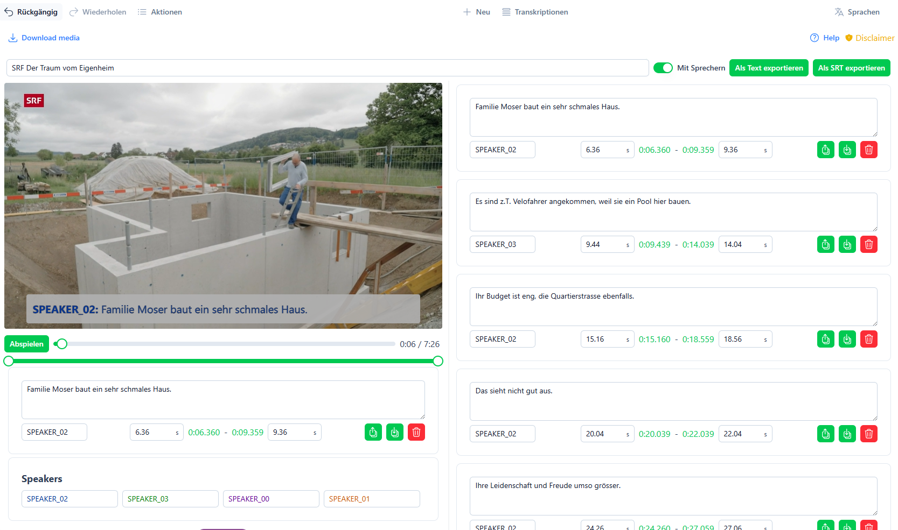

# Transcribo (Frontend)



Transcribo is a modern web application for audio and video transcription with advanced editing capabilities. Built with Nuxt.js and TypeScript, it provides a comprehensive set of tools for creating, editing, and managing transcriptions with timeline-based visualization. This repository contains only the frontend code; the backend is written in Python FastAPI and available at [https://github.com/DCC-BS/transcribo-backend](https://github.com/DCC-BS/transcribo-backend).
 [](https://biomejs.dev)

---

<p align="center">
  <a href="https://dcc-bs.github.io/documentation/">DCC Documentation & Guidelines</a> | <a href="https://www.bs.ch/daten/databs/dcc">DCC Website</a>
</p>

---

## Features

- **Audio/Video Transcription**: Upload media files and generate accurate transcriptions
- **Timeline Editor**: Visual timeline with spectrograms for precise segment editing
- **Speaker Management**: Assign and manage multiple speakers with color-coded segments
- **Real-time Editing**: Edit transcription text with live preview and validation
- **Export Options**: Export transcriptions as text or SRT subtitle files
- **Audio Recording**: Built-in audio recording capabilities for direct transcription
- **Undo/Redo System**: Comprehensive command system with full undo/redo support
- **Multilingual Support**: Available in English and German
- **Progressive Web App**: Installable PWA with offline capabilities

## Technology Stack

- **Frontend**: [Nuxt.js](https://nuxt.com/) with TypeScript and Composition API
- **UI Framework**: [Nuxt UI](https://ui.nuxt.com/)
- **Canvas Graphics**: [Konva.js](https://konvajs.org/) with Vue Konva for timeline visualization
- **Audio Processing**: [FFmpeg.wasm](https://ffmpegwasm.netlify.app/) for client-side media conversion
- **Package Manager**: [Bun](https://bun.sh/)
- **Internationalization**: Nuxt I18n
- **State Management**: Pinia with IndexedDB persistence
- **Code Quality**: Biome for linting and formatting

## Setup

### Environment Configuration

Create a `.env` file in the project root with the required environment variables:

```
API_URL=http://localhost:8000
LOG_LEVEL=debug
```

### Install Dependencies

Make sure to install dependencies using Bun:

```bash
bun install
```

## Development

Start the development server on `http://localhost:3000`:

```bash
bun run dev
```

For debugging with inspector:

```bash
bun run debug
```

### Backend Setup

Create a `.env.backend` file in the root directory with the required environment variables:

```
HF_AUTH_TOKEN=your_hugging_face_token
```

> **Note:** The `HF_AUTH_TOKEN` is required for Hugging Face API access. You can create a token [here](https://huggingface.co/settings/tokens).

Start the backend as a Docker container:

```bash
sudo docker compose up --build
```

Alternative clone the backend repository [transcribo-backend](https://github.com/DCC-BS/transcribo-backend) and run it locally.

## Testing & Linting

Run tests with Vitest:

```bash
# Run tests
bun test

# Run tests in watch mode
bun test:watch

# Generate coverage report
bun test:coverage
```

Format code with Biome:

```bash
bun run lint
```

Check and fix code issues:

```bash
bun run check
```

## Production

Build the application for production:

```bash
bun run build
```

Generate static site:

```bash
bun run generate
```

Preview production build:

```bash
bun run preview
```

## Docker Deployment

The application includes a multi-stage Dockerfile for production deployment:

```bash
# Build the Docker image
docker build -t transcribo-frontend .

# Run the container
docker run -p 3000:3000 transcribo-frontend
```

For a complete setup with backend services, use Docker Compose:

```bash
# Start all services (frontend, backend, and AI models)
sudo docker compose --profile frontend up --build

# Start only backend services
sudo docker compose up --build
```

## Project Architecture

- `assets/`: CSS styles and media files
- `components/`: Vue components for the UI including media players and timeline editors
- `composables/`: Reusable Vue composition functions for transcription services
- `i18n/`: Internationalization configuration for English and German
- `pages/`: Application pages and routes for transcription management
- `server/`: API endpoints and server middleware
- `stores/`: Pinia stores for transcription and task state management
- `types/`: TypeScript type definitions and command interfaces
- `utils/`: Utility functions for time formatting and speaker management

## Key Components

### Timeline Editor
- Visual representation of audio/video with spectrograms
- Drag-and-drop segment editing with snapping
- Real-time playhead synchronization
- Zoom and pan controls for precise editing

### Command System
- Reversible command pattern for all editing operations
- Full undo/redo functionality
- Localized command descriptions for user feedback

### Media Support
- Support for various audio and video formats
- Client-side media conversion using FFmpeg.wasm
- Built-in audio recording capabilities
- Media file management with IndexedDB storage

##  Acknowledgments
This application is based on [Transcribo](https://github.com/machinelearningZH/audio-transcription/) from the Statistical Office of the Canton of Zurich.
We have rewritten the functionality of the original application to fit into a modular and modern web application that separates frontend, backend and AI models.

## License

[MIT](LICENSE) © Data Competence Center Basel-Stadt

<a href="https://www.bs.ch/schwerpunkte/daten/databs/schwerpunkte/datenwissenschaften-und-ki"></a>

Datenwissenschaften und KI <br>
Developed with ❤️ by DCC - Data Competence Center
